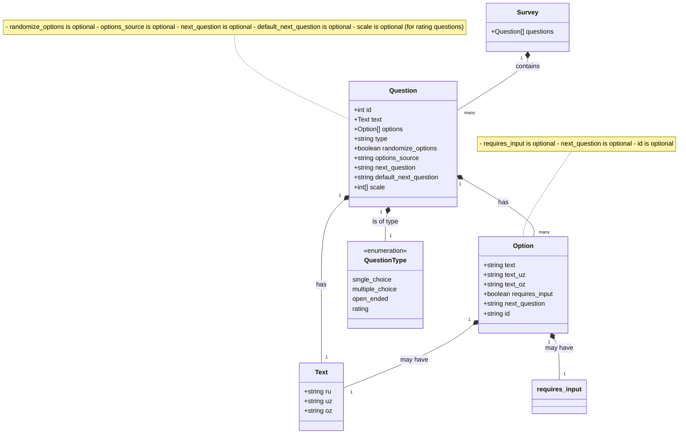

# PowerBI-Survey

# Survey Questions Structure Documentation

## Structure Diagram



## Detailed Structure Documentation

### Basic Question Structure

```json
{
  "id": number,
  "text": {
    "ru": "Russian text",
    "uz": "Uzbek text",
    "oz": "Uzbek (Cyrillic) text"
  },
  "options": Option[]
  "type": "single_choice" | "multiple_choice",
  "randomize_options"?: boolean
}
```

### Option Structure Variants

#### Basic Option
```json
{
  "text": "Option text"
}
```

#### Option with Custom Input
```json
{
  "text": "Свой вариант",
  "requires_input": true
}
```

### Question Type Examples

#### Single Choice Question
```json
{
  "id": 14,
  "text": {
    "ru": "Question text",
    "uz": "...",
    "oz": "..."
  },
  "options": [
    { "text": "Option 1" },
    { "text": "Option 2" }
  ],
  "type": "single_choice",
  "randomize_options": true
}
```

#### Multiple Choice Question
```json
{
  "id": 16,
  "text": {
    "ru": "Question text",
    "uz": "...",
    "oz": "..."
  },
  "options": [
    { "text": "Option 1" },
    { 
      "text": "Custom option",
      "requires_input": true
    }
  ],
  "type": "multiple_choice",
  "randomize_options": true
}
```

## Structure Components

1. **Question Object**
   - `id`: Unique identifier for the question
   - `text`: Object containing multilingual versions of the question
   - `options`: Array of possible answers
   - `type`: Question type (single_choice/multiple_choice)
   - `randomize_options`: Optional boolean to randomize option order

2. **Text Object**
   - `ru`: Russian language version
   - `uz`: Uzbek language version
   - `oz`: Uzbek (Cyrillic) language version

3. **Options Array**
   - Basic options: Only contain text
   - Input-enabled options: Contain text and requires_input flag

4. **Question Types**
   - `single_choice`: Only one option can be selected
   - `multiple_choice`: Multiple options can be selected

## Variations

The structure can vary in the following ways:

1. **Optional Fields**
   - `randomize_options` may be present or absent
   - Options may include or exclude `requires_input`

2. **Question Types**
   - Single choice questions allow only one selection
   - Multiple choice questions allow multiple selections

3. **Option Types**
   - Standard options with just text
   - Custom input options with requires_input flag

## Usage Notes

- All questions must have unique IDs
- Text must be provided in all three languages
- Options array must contain at least one option
- When `requires_input` is true, the option allows custom user input
- `randomize_options` when true will shuffle the order of options in presentation